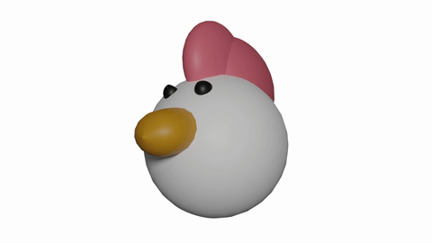
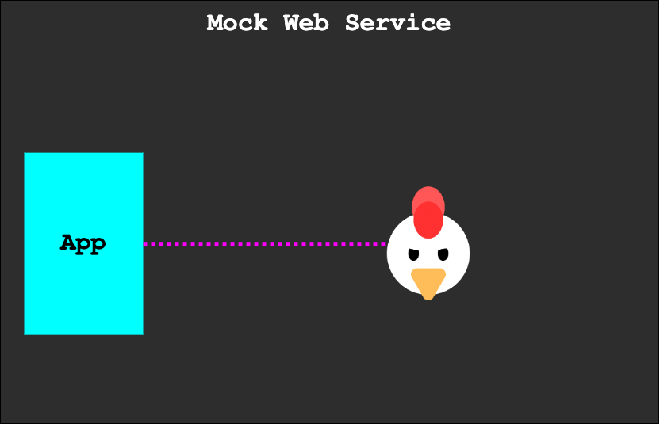
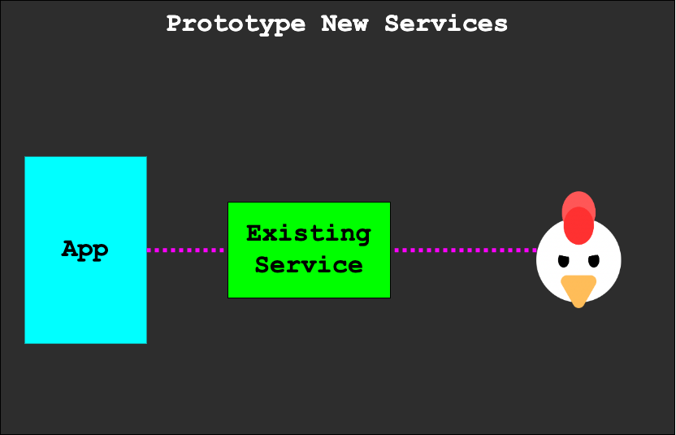
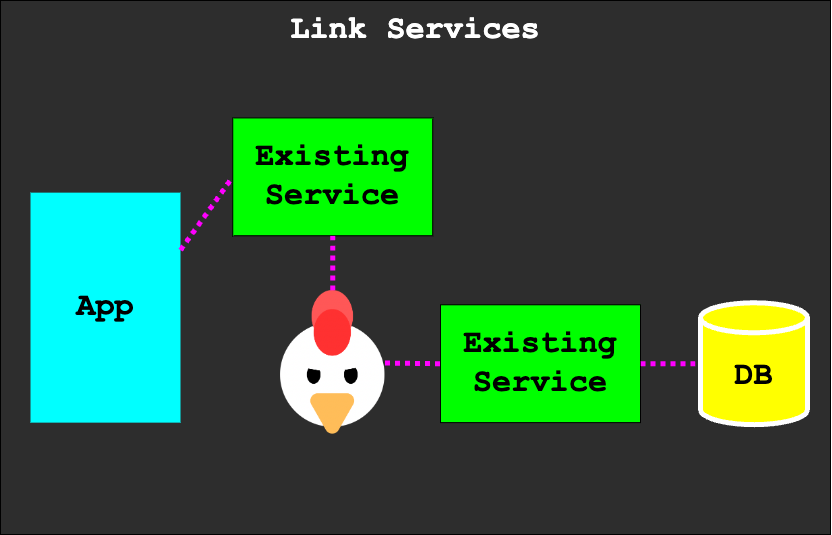
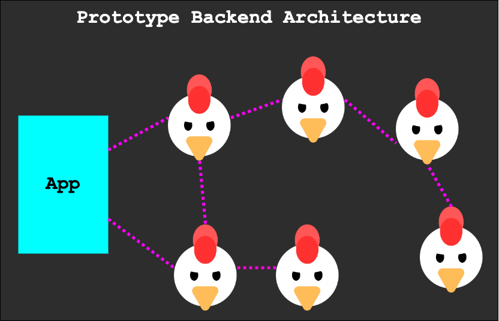

<p align="center">
  
</p>

<h1 align="center">🐔 ContractChicken</h1>
<h3 align="center">Quickly Mock RESTful APIs</h3>

---

## What is ContractChicken?

ContractChicken is a powerful command-line tool designed to expedite the process of mocking RESTful APIs effortlessly. It seamlessly integrates OpenAPI schemas, enhancing the speed and efficiency of API development.

## What Can ContractChicken Do?

*Mock a RESTful API service quickly*



*Mock new services in existing architecture*


*Link existing services without any development time.*


*Prototype your entire backend by chaining multiple ContractChicken services.*

ContractChicken empowers developers to:

- **Mock RESTful APIs**: Quickly create mock APIs from OpenAPI schemas.
- **Customize HTTP Status Codes**: Return different HTTP status codes for any endpoint in your contract using the `status=` query parameter.
- **Introduce Delays**: Simulate slow network conditions by adding artificial delays to responses with the `delay=` query parameter.

## Installing ContractChicken

You can easily install ContractChicken by running the following command:

```bash
npm install -g contractchicken
```
Get up and running by downloading one of our <a href="/example_contracts/">Example Contracts</a> and then running:

```bash
npx contractchicken [DOWNLOADED_CONTRACT_LOCATION]
```

## Using ContractChicken

Get started with ContractChicken by running the following command, replacing [OPENAPI_CONTRACT_LOCATION] with the location of your OpenAPI contract:
```bash
contractchicken [OPENAPI_CONTRACT_LOCATION]
```
### Returning Different HTTP Status Codes

You can customize the HTTP status code returned from any endpoint in your contract. Simply include the `status=` query parameter in your request with the desired status code.

### Returning with Delays

ContractChicken allows you to introduce delays to your responses, simulating slow network conditions. To add a delay, include the `delay=` query parameter in your request, specifying the delay time in milliseconds. This feature is particularly useful for testing under adverse network conditions.

Feel free to explore ContractChicken's capabilities and make your API development process more efficient and flexible. 🚀


### Added Recently
MULTIPLE servers
chainng
redirect url 
postman tests

### Coming Soon
Chain specific data
